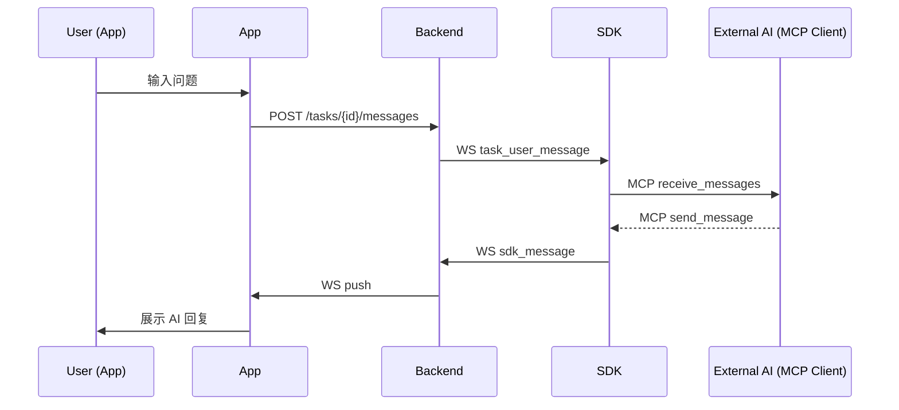
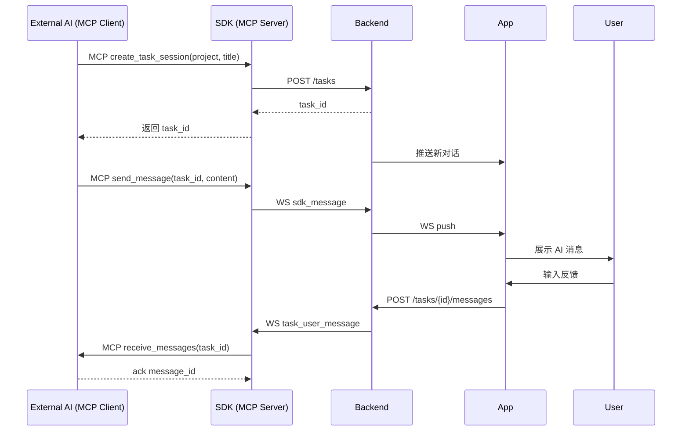

# Conductor 技术设计文档（plan.md）

本技术文档基于最终确定的三层架构 **App / Backend / SDK**，描述系统技术结构、协议、数据流、模块实现细节以及未来扩展方向。

---

# 1. 总体架构

```
┌──────────────────────────────────────────────────────────┐
│                  External AI Processes                   │
│  (Codex / CC / 自定义 Agent)                             │
│  - 运行在独立进程                                         │
│  - 通过 MCP Client 连接 SDK                               │
└───────────────↓───────────────────────────────┬──────────┘
                          MCP
┌───────────────────────────────────────────────┴──────────┐
│                             SDK                           │
│   - MCP Server（create_task / send_message / receive）     │
│   - 会话管理 / 消息路由                                   │
│   - WebSocket Client                                      │
└───────────────↑───────────────────────────────┬──────────┘
                          WS (long-lived)
┌───────────────────────────────────────────────┴──────────┐
│                         Backend                           │
│  - User/Auth                                               │
│  - Project/Task/Message Store                              │
│  - WS Hub  (App ↔ SDK 路由)                                │
│  - Push Notification                                       │
│  - Agent Registry / Heartbeat                              │
└───────────────↑───────────────────────────────┬──────────┘
                                HTTPS / WS
┌──────────────────────────────────────────────────────────┐
│                       Conductor App                      │
│   - Flutter UI                                           │
│   - Chat / Task / Log UI                                 │
│   - HTTPS / WebSocket client                             │
└──────────────────────────────────────────────────────────┘
```

---

# 2. 模块设计

## 2.1 App 模块（Flutter）
### 功能模块：
- **任务列表**：按状态过滤，显示最近进度
- **聊天界面**：支持 Markdown、代码块、消息类型
- **动作按钮**：Run Tests / Build / Patch 等 ChatOps
- **日志视图**：流式日志渲染
- **推送系统**
- **多 Agent 管理（v0.3）**

### 技术选型：
- Flutter
- dio（HTTP）
- web_socket_channel（WS）
- riverpod（状态管理）
- isar（本地离线缓存）
- flutter_markdown（渲染 AI 输出）

---

## 2.2 Backend 模块（控制平面）

### 核心职责：
- 用户鉴权
- 项目/任务/消息数据层
- App 和 SDK 的双向消息路由
- 推送系统（FCM/APNS）
- Agent 注册与状态管理

### 技术选型：
- NestJS（推荐） / Go（选）
- PostgreSQL
- Redis（WS 路由 & 缓存）
- Socket.IO / 原生 WS
- JWT Auth
- Docker/K8s

### 后端模块结构：
- `auth/`
- `project/`
- `task/`
- `message/`
- `realtime/`（WS Hub）
- `agent/`
- `notify/`

---

## 2.3 SDK 模块（执行层）

### 职责：
- 与 Backend 建立持久 WS 连接，感知 App 端的任务/消息事件。
- 通过 MCP Server 暴露基础工具（创建任务会话、发送消息、接收 App 端回复），供外部 AI 进程调用。
- 维护任务会话状态与消息缓冲，确保多 Agent/多模型协同时的一致性。
- 将外部 AI 的回复、状态同步到 Backend → App，形成远程协作闭环。

### 技术选型：
- Python 3.10+
- websockets 或 aiohttp
- httpx（调用 Backend REST 辅助接口）
- MCP 协议实现（如 open-mcp / 自研实现）
- asyncio
- pydantic（配置 & 数据结构）

### SDK 模块结构：
- `client/ws_client.py`（WS 长连接）
- `mcp/server.py`（MCP Server，对外暴露工具）
- `session/session_manager.py`（任务会话状态、消息缓存）
- `message/message_router.py`（消息路由、去重、重放）
- `context/project_context.py`（路径映射、repo 元数据，用于工具提供上下文）
- `reporter/event_stream.py`（状态/事件上报）
- `config/config.yaml`

首批 MCP 工具（v1）：

| Tool 名称 | 作用 | 入参 | 返回值 |
| --- | --- | --- | --- |
| `create_task_session` | 在 Backend 创建 Task，并驱动 App 生成新的聊天对话框。 | `project_id`、`title`、可选初始用户消息 `prefill` | `{ "task_id": "...", "session_id": "...", "app_url": "..." }` |
| `send_message` | 将外部 AI 的回复注入 Backend → App，支持 Markdown/代码块。 | `task_id`、`content`、`metadata`(可选，如模型名、延迟) | `{ "message_id": "...", "delivered": true }` |
| `receive_messages` | 拉取 App 端用户/系统消息，支持 offset / ack，默认只返回未读。 | `task_id`、`ack_token`(可选)、`limit` | `{ "messages": [...], "next_ack_token": "...", "has_more": true/false }` |
| `ack_messages` | 显式确认已处理的消息，避免重复推送。 | `task_id`、`ack_token` | `{ "status": "ok" }` |
| `list_sessions`（可选） | 列出当前 SDK 维护的会话上下文（task_id、最近消息时间）。 | `project_id`(可选) | `[{ "task_id": "...", "title": "...", "last_message_at": "..." }]` |

## 2.4 模块任务拆解与依赖

### 2.4.1 原则
- 模块需具备独立的接口契约与可观察输出（日志、API、UI），方便单独编译/运行/测试。
- 先实现被依赖的底座模块（配置、数据层、协议层），再实现上层交互模块，避免反复返工。
- 为每个模块定义直接依赖与测试入口（unit/integration/widget/E2E stub），确保可在 CI 中独立执行。

### 2.4.2 Backend 控制平面任务
| 模块 | 主要任务 | 可独立测试 | 直接依赖 | 优先级 |
| --- | --- | --- | --- | --- |
| `db/redis foundation` | 定义 PostgreSQL schema、Redis key 约定、基础 repository（project/task/message）。 | SQL migration 测试 + repository 单测（NestJS testing module）。 | 无 | P0 |
| `auth` | JWT 签发/校验、Agent Token、用户 CRUD API。 | controller/service 单测 + token 集成测试（mock db）。 | 数据层 | P0 |
| `project-task` | Project/Task API、状态机、任务过滤。 | service 单测 + API contract 测试（supertest）。 | 数据层、auth | P1 |
| `message` | 消息持久化、分页、富文本（Markdown）校验。 | repository 单测 + API contract。 | 数据层、project-task | P1 |
| `realtime` | WS Hub、会话路由、消息 fan-out、心跳。 | WebSocket 集成测试（supertest + ws client mock）。 | auth、message | P2 |
| `agent` | Agent 注册、心跳、能力描述、任务分配。 | service 单测 + WS stub 测试。 | realtime、project-task | P2 |
| `notify` | 推送/邮件、失败重试、订阅偏好。 | 集成测试（使用本地 FCM/APNS mock）。 | message、agent | P3 |

### 2.4.3 SDK 执行层任务
| 模块 | 主要任务 | 可独立测试 | 直接依赖 | 优先级 |
| --- | --- | --- | --- | --- |
| `config` | 解析 config.yaml / env、校验必填项。 | pydantic 模型单测。 | 无 | P0 |
| `ws_client` | 与 Backend 建立/保持 WebSocket、自动重连。 | async 单测（pytest + pytest-asyncio）。 | config | P0 |
| `session_manager` | 任务会话生命周期、消息缓冲、重放。 | state 单测（pytest）。 | config、ws_client | P1 |
| `message_router` | App ↔ SDK 消息路由、去重、过滤。 | integration test（mock ws client）。 | ws_client、session_manager | P1 |
| `project_context` | 提供项目/仓库元信息给 MCP 工具。 | 本地仓库 fixture 单测。 | config | P1 |
| `mcp_server` | MCP Server，暴露 `create_task` / `send_message` / `receive_message` 工具。 | integration test（pytest-asyncio + mock ws）。 | ws_client、session_manager、message_router、project_context | P2 |
| `reporter/event_stream` | SDK → Backend 状态同步、工具调用审计。 | aiohttp mock 集成测试。 | ws_client | P2 |
| `orchestrator` | 会话编排、错误恢复、协调外部 AI 进程。 | end-to-end stub（mock ws + mock mcp client）。 | 上述所有 | P3 |

### 2.4.4 App (Flutter) 任务
| 模块 | 主要任务 | 可独立测试 | 直接依赖 | 优先级 |
| --- | --- | --- | --- | --- |
| `data/http_client` | dio 封装、鉴权拦截器、错误处理。 | unit test（mocktail）。 | 无 | P0 |
| `data/ws_client` | web_socket_channel 封装、心跳重连。 | unit test + integration（fake backend）。 | http_client | P0 |
| `state/project_task_provider` | riverpod store、状态缓存、离线策略。 | riverpod unit test。 | data 层 | P1 |
| `ui/task_list` | 任务列表、筛选、刷新。 | widget test（golden）。 | state layer | P1 |
| `ui/chat` | 消息流 + Markdown 渲染 + action bar。 | widget test + markdown 渲染单测。 | state layer、ws client | P2 |
| `ui/log_view` | 日志流终端、复制、颜色映射。 | widget test（log 模拟）。 | ws client | P2 |
| `agent_management` | Agent 列表、健康指示、push 订阅。 | widget test + integration（fake push）。 | state layer、push svc | P3 |

### 2.4.5 跨层依赖顺序
1. Backend `db foundation` + `auth` 决定 API/WS 协议 → SDK/App 根据 schema 生成客户端。
2. Backend `realtime` 完成后，SDK `ws_client` 与 App `ws_client` 才能进入联调。
3. SDK `mcp_server` 依赖 `ws_client`、`session_manager`、`project_context`，完成后外部 AI 才能通过 MCP 工具驱动 Backend → App 的任务对话。
4. App UI 模块均依赖 `state layer`，因此需优先实现数据与状态管理，再逐步解锁 Task List → Chat → Log → Agent 管理。
5. 集成测试顺序：Backend+SDK（任务执行链路） → Backend+App（任务可视化） → 全链路（E2E）。

---

# 3. 数据模型（技术版）

## Task
```json
{
  "id": "uuid",
  "project_id": "uuid",
  "title": "string",
  "status": "CREATED|RUNNING|DONE|FAILED",
  "created_at": "timestamp"
}
```

## Message
```json
{
  "id": "uuid",
  "task_id": "uuid",
  "role": "user|ai|sdk|system|log",
  "content": "string",
  "timestamp": "timestamp"
}
```

## Agent
```json
{
  "id": "uuid",
  "token": "string",
  "status": "ONLINE|OFFLINE",
  "projects": ["path1", "path2"]
}
```

## TaskSession
```json
{
  "task_id": "uuid",
  "session_id": "string",
  "project_id": "uuid",
  "status": "ACTIVE|ENDED",
  "created_at": "timestamp",
  "last_message_at": "timestamp"
}
```

## MCPMessage
```json
{
  "message_id": "uuid",
  "task_id": "uuid",
  "role": "user|app|sdk|system",
  "content": "markdown string",
  "ack_token": "string",
  "created_at": "timestamp"
}
```

---

# 4. API 设计（Backend）

## 4.1 REST API

### POST /auth/login
### GET /projects
### GET /tasks?project_id=xxx
### POST /tasks
### GET /tasks/:id/messages
### POST /tasks/:id/messages

## 4.2 WebSocket 通道
- `/ws/app` → app 连接
- `/ws/agent` → sdk 连接

后端根据连接类型进入不同 namespace。

---

# 5. WebSocket 协议（核心）

## 5.1 App → Backend
### 发送聊天消息：
```json
{
  "type": "user_message",
  "task_id": "uuid",
  "content": "string"
}
```

### 发送动作请求：
```json
{
  "type": "action",
  "task_id": "uuid",
  "action": "run_tests",
  "args": {}
}
```

---

## 5.2 Backend → SDK
```json
{
  "type": "task_event",
  "task_id": "uuid",
  "content": "string or action"
}
```

---

## 5.3 SDK → Backend
### AI 输出
```json
{
  "type": "ai_message",
  "task_id": "uuid",
  "content": "string"
}
```

### 日志流
```json
{
  "type": "log_chunk",
  "task_id": "uuid",
  "content": "partial log"
}
```

### 状态
```json
{
  "type": "status",
  "agent_id": "uuid",
  "status": "ONLINE|OFFLINE"
}
```

---

# 6. 执行流程（技术）

## 6.1 AI 回复流程
```
App → Backend → SDK
SDK → AI 模型 → SDK
SDK → Backend → App
```

## 6.2 动作执行流程
```
App → Backend → SDK
SDK → shell subprocess → SDK
SDK → Backend → App （流式日志）
```

---

# 7. 配置系统（SDK）

`~/.conductor/config.yaml`
```yaml
agent_token: "xxx"
projects:
  - path: /Users/.../repo1
    default_model: gpt-4.1
  - path: /data/project2
    env: conda:project2
```

---

# 8. 部署方案

## Backend（推荐）：
- Docker Compose（MVP）
- 或 K8s（生产）
- PostgreSQL + Redis
- Nginx 反向代理

## SDK：
- 本地常驻进程（systemd）
- Mac/Linux/Windows 通用

## App：
- iOS / Android 各自发布

---

# 9. 安全设计
- 全链路 HTTPS/WSS
- Agent Token（仅出站，不暴露服务端口）
- JWT（App 用户）
- SDK sandbox（限制可执行动作）
- 后端权限校验（任务归属）

---

# 10. 可扩展性设计
- 多 Agent 扩展
- 多模型路由
- 模型缓存（减少消耗）
- 执行排队 / 并发控制
- 插件动作（Action Plugin System）

---

# 11. 后续版本规划

## v0.1
- 基础三层通信
- 聊天 + AI 回复
- run_tests
- 日志流

## v0.2
- patch 生成
- 文件分析
- 动作插件系统

## v0.3
- 多 Agent
- 项目回顾
- 本地 LLM 后端

---

# 12. 总结
本技术方案基于三层架构构建：App → Backend → SDK，职责清晰、易扩展、安全可控。SDK 执行层承担本地所有实际操作，实现 Conductor 的核心特色：**对话驱动真实本地任务执行**。


# 13. SDK 与 Backend WebSocket 协议 JSON Schema

> 以下为逻辑 JSON Schema，用于约束 SDK ↔ Backend 之间的 WS 消息结构（不要求严格实现为 JSON Schema 文件，但可作为类型定义参考）。

## 13.1 通用包裹结构

所有经 WS 传输的消息统一使用：

```json
{
  "type": "string",         
  "request_id": "string",   
  "timestamp": "string",    
  "payload": {}              
}
```

- `type`：消息类型枚举
- `request_id`：可选，用于请求-响应配对（由 Backend 或 SDK 生成）
- `timestamp`：ISO 8601 时间戳
- `payload`：不同 type 下的具体内容

## 13.2 从 Backend → SDK 的消息

### 13.2.1 分发用户消息（AI 对话）

```json
{
  "type": "task_user_message",
  "request_id": "uuid",
  "timestamp": "2025-01-01T00:00:00Z",
  "payload": {
    "task_id": "uuid",
    "project_id": "uuid",
    "content": "帮我分析 navigation/path_planner.py 的 update()", 
    "meta": {
      "user_id": "uuid",
      "conversation_id": "uuid"
    }
  }
}
```

### 13.2.2 动作请求（执行指令）

```json
{
  "type": "task_action",
  "request_id": "uuid",
  "timestamp": "2025-01-01T00:00:00Z",
  "payload": {
    "task_id": "uuid",
    "project_id": "uuid",
    "action": "run_tests",           
    "args": {                         
      "command": "pytest tests/nav"  
    }
  }
}
```

### 13.2.3 Agent 配置更新

```json
{
  "type": "agent_config_update",
  "request_id": "uuid",
  "timestamp": "2025-01-01T00:00:00Z",
  "payload": {
    "agent_id": "uuid",
    "configs": {
      "default_model": "gpt-4.1-mini",
      "max_parallel_tasks": 2
    }
  }
}
```

---

## 13.3 从 SDK → Backend 的消息

### 13.3.1 AI 消息

```json
{
  "type": "ai_message",
  "request_id": "uuid",
  "timestamp": "2025-01-01T00:00:01Z",
  "payload": {
    "task_id": "uuid",
    "role": "ai",
    "content": "这里是三个优化方案……",
    "meta": {
      "model": "gpt-4.1-mini",
      "tokens": 1234
    }
  }
}
```

### 13.3.2 日志分片（流式）

```json
{
  "type": "log_chunk",
  "request_id": "uuid",
  "timestamp": "2025-01-01T00:00:02Z",
  "payload": {
    "task_id": "uuid",
    "chunk": "[INFO] Running pytest...",
    "is_last": false
  }
}
```

### 13.3.3 任务状态更新

```json
{
  "type": "task_status_update",
  "request_id": "uuid",
  "timestamp": "2025-01-01T00:00:03Z",
  "payload": {
    "task_id": "uuid",
    "status": "RUNNING",
    "progress": 0.3,
    "summary": "测试执行中",
    "meta": {
      "started_at": "2025-01-01T00:00:01Z"
    }
  }
}
```

### 13.3.4 Agent 状态心跳

```json
{
  "type": "agent_heartbeat",
  "request_id": "uuid",
  "timestamp": "2025-01-01T00:00:05Z",
  "payload": {
    "agent_id": "uuid",
    "status": "ONLINE",              
    "version": "0.1.0",
    "projects": [
      {
        "path": "/repo/nav",
        "project_id": "uuid"
      }
    ]
  }
}
```

### 13.3.5 错误上报

```json
{
  "type": "agent_error",
  "request_id": "uuid",
  "timestamp": "2025-01-01T00:00:06Z",
  "payload": {
    "task_id": "uuid",
    "error_code": "SCRIPT_FAILED",
    "message": "pytest exited with code 1",
    "details": "traceback..."
  }
}
```

## 13.6 MCP 工具契约

### 13.6.1 create_task_session

**Request**
```json
{
  "task_title": "Fix crash",
  "project_id": "uuid",
  "prefill": "用户上下文，可选"
}
```

**Response**
```json
{
  "task_id": "uuid",
  "session_id": "string",
  "app_url": "https://app.conductor/tasks/uuid"
}
```

### 13.6.2 send_message

**Request**
```json
{
  "task_id": "uuid",
  "content": "Markdown text with code blocks",
  "metadata": {
    "model": "codex",
    "latency_ms": 1200
  }
}
```

**Response**
```json
{
  "message_id": "uuid",
  "delivered": true
}
```

### 13.6.3 receive_messages

**Request**
```json
{
  "task_id": "uuid",
  "ack_token": "opaque-string",
  "limit": 20
}
```

**Response**
```json
{
  "messages": [
    {
      "message_id": "uuid",
      "role": "user",
      "content": "请更新文档",
      "ack_token": "opaque-string",
      "created_at": "2025-01-01T00:00:06Z"
    }
  ],
  "next_ack_token": "opaque-string",
  "has_more": false
}
```

### 13.6.4 ack_messages

**Request**
```json
{
  "task_id": "uuid",
  "ack_token": "opaque-string"
}
```

**Response**
```json
{ "status": "ok" }
```

---

# 14. Backend OpenAPI 3.0 接口文档（概要）

> 此处给出精简版 OpenAPI 结构，方便后续导出为 swagger.yaml / swagger.json。

## 14.1 Info

- title: Conductor Backend API
- version: 0.1.0

## 14.2 Paths（核心）

### POST /auth/login
- 描述：用户名/密码登录
- 请求：
```json
{
  "email": "string",
  "password": "string"
}
```
- 响应：
```json
{
  "access_token": "jwt",
  "refresh_token": "jwt"
}
```

---

### GET /projects
- 说明：获取当前用户可见项目列表
- 响应示例：
```json
[
  {
    "id": "uuid",
    "name": "nav-system",
    "description": "导航模块",
    "created_at": "2025-01-01T00:00:00Z"
  }
]
```

### GET /tasks
- 查询参数：`project_id?`, `status?`，分页参数

### POST /tasks
- 创建任务
```json
{
  "project_id": "uuid",
  "title": "string",
  "description": "string (optional)"
}
```

### GET /tasks/{task_id}
- 返回任务详情（含最近状态）

### GET /tasks/{task_id}/messages
- 返回该任务下的消息列表（分页）

### POST /tasks/{task_id}/messages
- 发送用户消息（用于 AI 对话）
```json
{
  "content": "string"
}
```

### POST /tasks/{task_id}/actions
- 向 SDK 发送执行指令
```json
{
  "action": "run_tests",
  "args": {
    "command": "pytest tests/nav"
  }
}
```

### GET /agents
- 管理员/用户查看自己绑定 Agent 列表

### POST /agents/token
- 生成用于 SDK 注册的 agent_token

---

## 14.3 Components Schemas（示意）

- `Project`
- `Task`
- `Message`
- `Agent`
- `ActionRequest`
- `User`

可在真正实现时转成完整 OpenAPI 3.0 文档。

---

# 15. 三端目录结构设计

## 15.1 App 目录结构（Flutter）

```text
conductor_app/
  lib/
    main.dart
    core/
      config/
      network/
      models/
    features/
      auth/
        login_page.dart
        auth_controller.dart
      projects/
        project_list_page.dart
      tasks/
        task_list_page.dart
        task_detail_page.dart
      chat/
        chat_page.dart
        chat_controller.dart
      logs/
        log_viewer_page.dart
    widgets/
      message_bubble.dart
      task_card.dart
      status_chip.dart
  assets/
  test/
```

## 15.2 Backend 目录结构（NestJS 示例）

```text
conductor_backend/
  src/
    main.ts
    app.module.ts
    config/
    common/
      guards/
      interceptors/
      filters/
    auth/
      auth.controller.ts
      auth.service.ts
      auth.module.ts
    users/
    projects/
    tasks/
    messages/
    agents/
    realtime/
      ws.gateway.ts   # WS Hub (App & SDK)
    notify/
      push.service.ts
  prisma/ or entities/
  test/
```

## 15.3 SDK 目录结构（Python）

```text
conductor_sdk/
  conductor/
    __init__.py
    cli.py                # 入口 CLI
    config/
      loader.py           # 读取 yaml
    ws/
      client.py           # 与 Backend 的 WS
      handlers.py         # 消息处理
    mcp/
      server.py           # MCP Server，注册 create_task/send_message 等工具
      tools.py            # 对外暴露的工具定义
    session/
      session_manager.py  # 任务会话与消息缓存
    message/
      router.py           # 消息路由/去重
    context/
      project_context.py  # repo 元信息、路径映射
    reporter/
      event_stream.py
```

---

# 16. 消息序列图 / 架构图（Mermaid）

## 16.1 AI 对话序列图



## 16.2 MCP 会话序列图（create_task + send/receive）



---

# 17. App UI 线框图（Wireframe，文字版）

## 17.1 首页：项目 & 任务总览
- 顶部：Conductor 标题 + 用户头像
- 中部：
  - Tab1：Projects
  - Tab2：Tasks
- Project 卡片：名称 / 描述 / 最近任务数
- Task 卡片：标题 / 状态标签 / 更新时间

## 17.2 任务详情页
- 顶部：Task 标题 + 状态（彩色 Chip）
- 中部：
  - Segment 控件：Chat | Logs | Info
- Chat：
  - 类似聊天气泡 UI
  - 左侧：AI/系统消息
  - 右侧：用户消息
  - 中间嵌入执行日志/状态消息
- 底部输入框：
  - 文本框 + 发送按钮
  - Action 按钮条：Run Tests / Build / Patch / More

## 17.3 日志视图
- 类似终端风格
- 支持：
  - 自动滚动到底部
  - 复制整段日志
  - 按 severity 颜色区分（INFO/WARN/ERROR）

## 17.4 Agent 管理页
- 列出所有 Agent：
  - 名称 / 在线状态 / 版本
- 点击进入详情：
  - 绑定项目列表
  - 最近任务执行记录

---

# 18. 开发路线图（Roadmap 详细版）

## Phase 0：PoC（1-2 周）
- 后端：简单 WS + REST
- SDK：能够接收文本，调用 AI，再返回文本
- App：Web 端 demo 或简易 Flutter 界面

## Phase 1：MVP（4-6 周）
- 完整三层连通
- 任务创建 / 消息流转
- AI 对话
- run_script 基础动作
- 流式日志

## Phase 2：Developer Preview（6-8 周）
- run_tests / build 等动作
- patch 生成 + diff 展示
- 更完整的项目/任务/消息数据结构
- 基本安全方案（JWT + Agent Token）
- iOS/Android TestFlight 内测

## Phase 3：Beta（8-12 周）
- 多 Agent 支持
- 多模型路由
- 更完善的 UI/UX
- 操作审计
- 更精细的权限控制

## Phase 4：Public Release
- 文档 & SDK 发布
- 插件系统（自定义 Action）
- 部分开源组件（如 SDK）

---

# 19. 测试计划（Test Plan）

## 19.1 测试范围
- App（UI & 功能）
- Backend（API & WS）
- SDK（任务执行 & AI 调用）
- 三层集成（E2E）

## 19.2 测试类型

### 19.2.1 单元测试
- Backend：service / controller / repository
- SDK：actions / mcp_server / script_runner
- App：状态管理逻辑

### 19.2.2 集成测试
- Backend + DB + Redis
- SDK 连接测试环境 Backend
- 模拟 AI 响应

### 19.2.3 端到端测试（E2E）
- 场景：
  - 创建任务 → 发送消息 → AI 回复
  - 创建任务 → 触发 run_tests → 生成日志 → 状态更新
  - Agent 掉线 → App 状态更新 & 提示

### 19.2.4 性能测试
- 多任务并发
- 日志流量测试（长日志）
- WS 连接稳定性

### 19.2.5 安全测试
- 鉴权绕过测试
- Token 伪造
- 不合法 action 注入（例如运行不在白名单的命令）

## 19.3 测试环境
- Dev：本地 Docker Compose
- Staging：云端部署一套全链路

## 19.4 验收标准
- E2E 核心流程通过率 >= 95%
- 单元测试覆盖率 Backend & SDK >= 70%
- 日志流延迟控制在目标内（<200ms 平均）

---

# 20. 总结补充

本次扩展后的 plan.md 已包含：
- WebSocket 协议 JSON Schema
- Backend OpenAPI 3.0 概要
- 三端目录结构
- Mermaid 序列图与架构逻辑
- App UI 线框文字描述
- 更详细的开发路线图与测试计划

可直接作为项目的技术蓝图，指导后续落地开发与团队协作。
